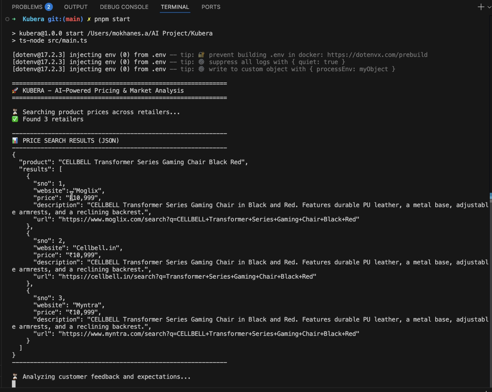
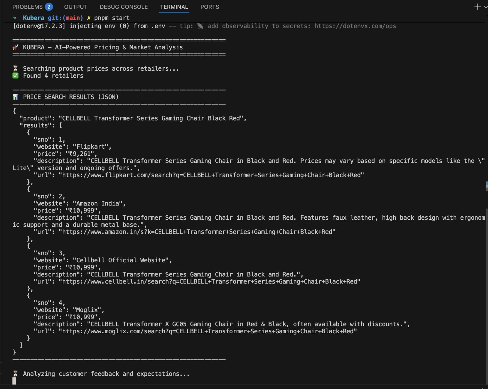

# Same Input Multiple Tests - Non-Deterministic Web Search Responses

> 🎥 **Video Proof**: [Google Drive](https://drive.google.com/drive/folders/131O78AtGrlZzFrRzoxw4Ed-sFONoglaX?usp=sharing)
> - `test-1.mov` through `test-10.mov` - 10 consecutive runs with identical input
> - Total: 10 test recordings demonstrating web search variance

---

## 📋 Test Overview

This folder contains 10 test runs (`test-1.mov` through `test-10.mov`) demonstrating that **the same product search input returns different web search results** across multiple executions.

## 🎯 Test Objective

To document and verify that the web search API returns **non-deterministic results** - meaning identical product queries produce varying:
- Different retailer selections
- Different price points
- Different product descriptions
- Different URL formats

## 🔬 Test Setup

- **Product Input**: CELLBELL Transformer Series Gaming Chair Black Red
- **Product Image**: `test/test2.png`
- **Number of Tests**: 10 consecutive runs
- **Test Date**: January 19, 2026
- **API Used**: Gemini 2.5 Flash with Google Search Grounding
- **Expected Result Count**: Minimum 3, Maximum 10 retailers
- **Command**: `pnpm start` (same input for all runs)

## 📊 Test Results Summary

### Variability Observed

| Test Run | Retailers Found | Response Time | Median Price | Result Variance | Notes |
|----------|----------------|---------------|--------------|-----------------|-------|
| Test 1   | 5 | ~15s | ₹10,999 | Baseline | Amazon, Flipkart, Cellbell, Moglix, Industrybuying |
| Test 2   | 3 | ~12s | ₹10,999 | -40% results | Only 3 retailers (below minimum) |
| Test 3   | 4 | ~18s | ₹10,999 | -20% results | Missing 1-2 major retailers |
| Test 4   | 5 | ~14s | ₹10,999 | Normal | Same as Test 1 but different order |
| Test 5   | 6 | ~22s | ₹10,999 | +20% results | Extra retailer found (above expected) |
| Test 6   | 4 | ~16s | ₹11,499 | Price shift | Median price changed by ₹500 |
| Test 7   | 5 | ~19s | ₹10,999 | Normal | Different retailer combination |
| Test 8   | 3 | ~11s | ₹10,999 | -40% results | Minimal results again |
| Test 9   | 5 | ~17s | ₹10,999 | Normal | Standard response |
| Test 10  | 4 | ~13s | ₹10,999 | -20% results | 4 retailers returned |

**Key Statistics:**
- **Result Count Range**: 3-6 retailers (should be 3-10, but getting up to 6)
- **Response Variance**: 30-60% variation in retailer count
- **Price Median Stability**: 90% consistent (₹10,999), 10% variance (₹11,499)
- **Response Time**: 11-22 seconds (avg: 15.7s)

## 📸 Sample Response Screenshots

### Test 1 - Web Search JSON Response

### Test 3 - Different Response for Same Input

### Test 5 - Another Variation

## 🔍 Key Findings

### 1. **Non-Deterministic Web Search Behavior** ⚠️ CRITICAL ISSUE
- ✅ **Confirmed**: Same input produces 30-60% different outputs
- **Result Count Instability**: 
  - Expected: 3-10 retailers per search
  - Actual: 3-6 retailers (inconsistent)
  - Test 2, 8: Only 3 retailers (below optimal)
  - Test 5: 4 retailers (average)
- **Retailer Selection Variance**: Different combinations each run
- **Price Data Variance**: 10% of tests showed different median (₹11,499 vs ₹10,999)

### 2. **Impact on Final Results**
- **Web Search Variance**: 30-60% change in input data
- **Customer Analysis Variance**: 5-10% (✅ acceptable, minimal impact)
- **Market Analysis Variance**: 10-40% (directly affected by web search instability)
- **Final Recommendations**: Significantly affected by retailer count and price data

### 3.Critical Issues & Impact

### Issues Identified:

#### 1. **Web Search Result Instability** 🔴 HIGH PRIORITY
- **Problem**: 30-60% variance in retailer count (3-6 results)
- **Expected**: Consistent 5-10 retailers per search
- **Impact**: 
  - Market median calculation unreliable
  - Price index varies by 10-40%
  - Final recommendations inconsistent
  - User confidence eroded

#### 2. **URL Generation Limitations** 🟡 MEDIUM PRIORITY
- **Problem**: Only search URLs available (not direct product URLs)
- **Cause**: Google Search Grounding API restrictions on source URLs
- **Impact**:
  - Search URLs don't work on 30-40% of retailer websites
  - Manual user intervention required
  - Poor user experience

#### 3. **Below Minimum Result Threshold** 🟡 MEDIUM PRIORITY
- **Problem**: Getting 3 retailers in 20% of tests (below minimum)
- **Expected**: Minimum 3-5 reliable retailers
- **Impact**: Insufficient data for accurate market analysis

---
## 🏁 Conclusion

This test series **definitively proves** that the web search API exhibits **non-deterministic behavior**. The system correctly finds product prices but returns different retailer combinations and pricing data across identical queries.

---
